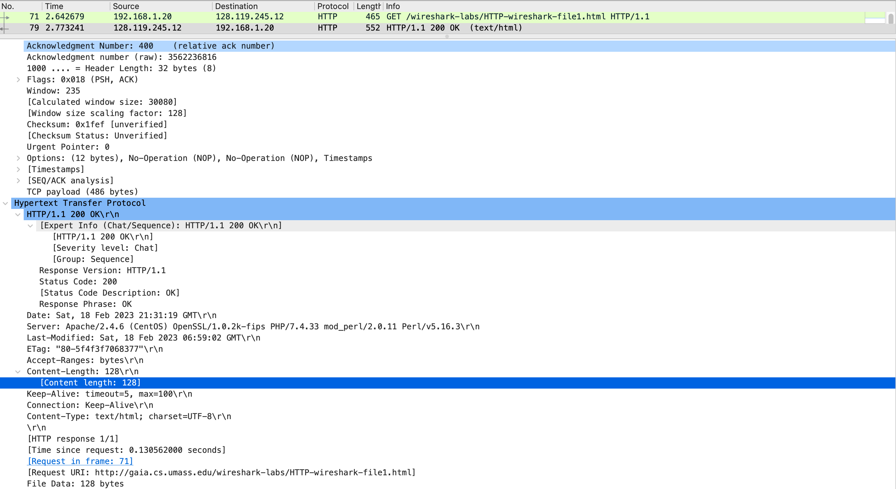
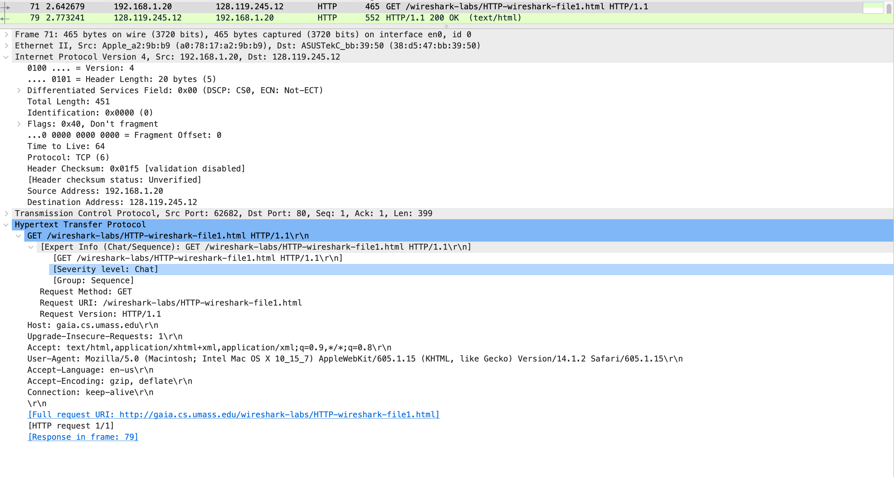
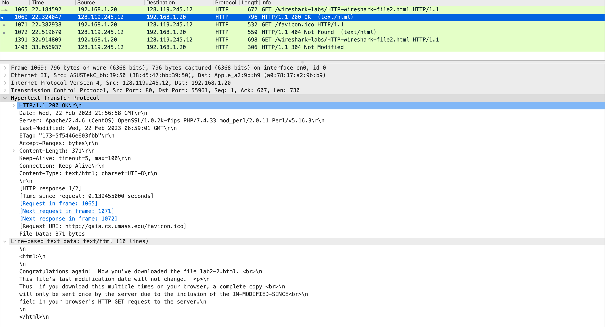
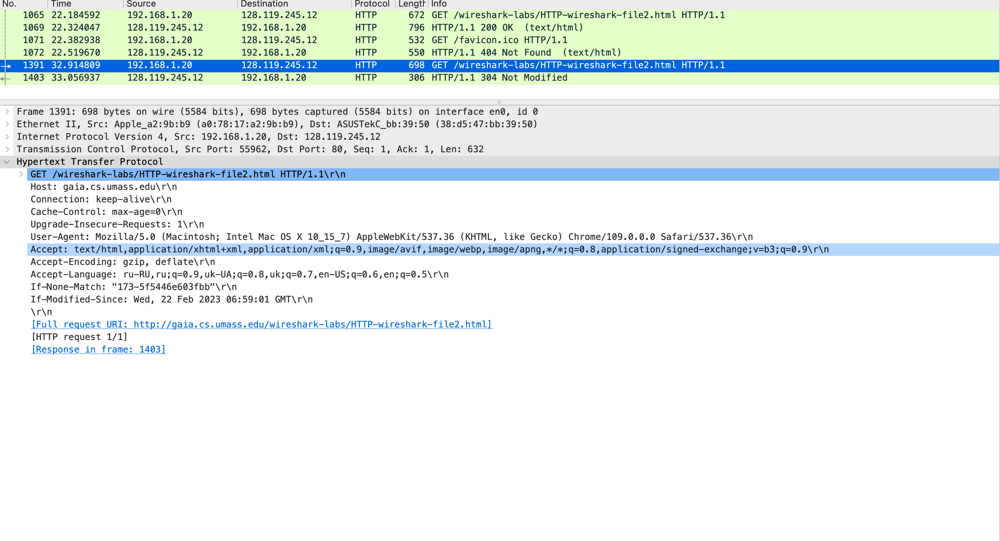
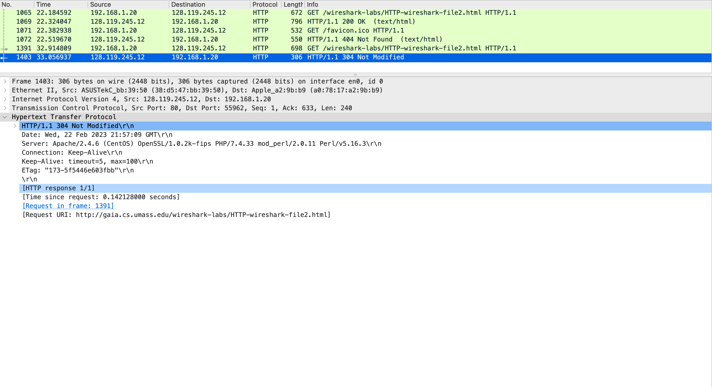
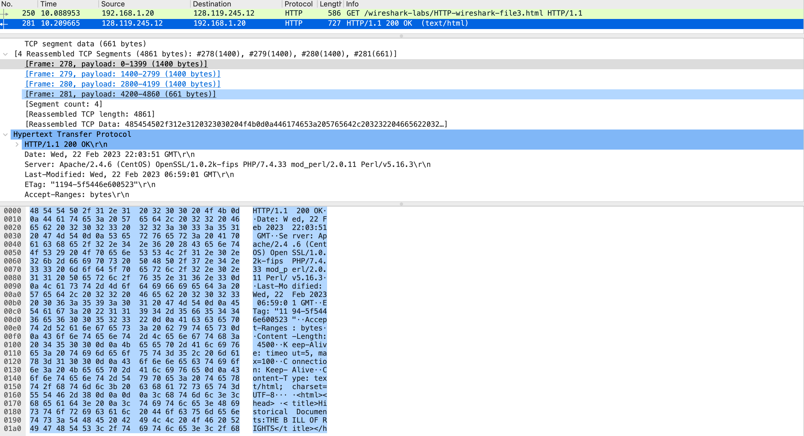
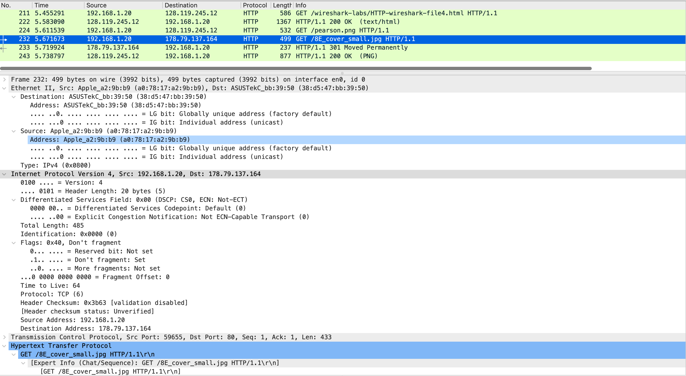
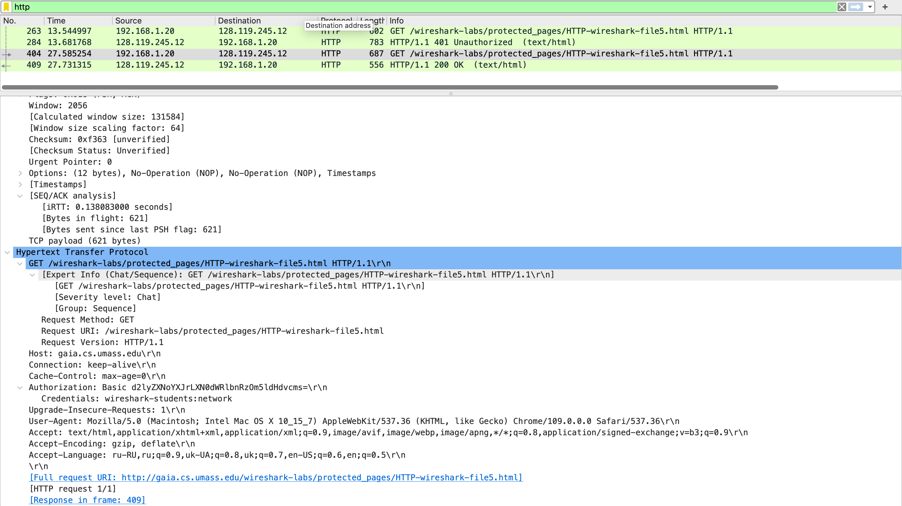

## HW 1, Павленко Даниил

### Задание 1

* ``Использует ли ваш браузер HTTP версии 1.0 или 1.1? Какая версия HTTP работает на
сервере?`` \
Ответ: браузер использует HTTP версию 1.1. На сервере так же работает HTTP версии 1.1. (поле *Expert Info* на первом скриншоте)

* ``Какие языки (если есть) ваш браузер может принимать? В захваченном сеансе какую еще
  информацию (если есть) браузер предоставляет серверу относительно
  пользователя/браузера? `` \
Ответ: в запросе GET содержится информация, что браузер принимает язык `en-us`. Также содержится информация, что браузер
принимает следующие параметры файлов: text, html, xhtml и xml; поддерживает сжатие gzip и deflate;
юзер-агентов. 

* ``Какой IP-адрес вашего компьютера? Какой адрес сервера gaia.cs.umass.edu?`` \
Ответ: IP-адрес компьютера - `192.168.1.20`, адрес сервера - `128.119.245.12`. 
(поля *Source* и *Destination* на первом скриншоте)

* ``Какой код состояния возвращается с сервера на ваш браузер?``\
Ответ: 200 (OK) (идет сразу после раздела *Hypertext Transfer Protocol* Wireshark'a на втором скриншоте)

* ``Когда HTML-файл, который вы извлекаете, последний раз модифицировался на сервере?``\
Ответ: Суббота, 18 февраля 2023 (поле *Last Modified* в разделе *Hypertext Transfer Protocol* на первом скриншоте)

* ``Сколько байтов контента возвращается вашему браузеру?``\
Ответ: 128 (поле *Content Length* в разделе *Hypertext Transfer Protocol* на первом скриншоте)

### Задание 2 
* ``Проверьте содержимое первого HTTP-запроса GET. Видите ли вы строку «IF-MODIFIEDSINCE» в HTTP GET?``\
Ответ: такого поля нет (во всяком случае я не смог его найти)

* ``Проверьте содержимое ответа сервера. Вернул ли сервер содержимое файла явно? Как вы
  это можете увидеть?``\
Ответ: сервер не вернул содержимое файла явно, так как в поле *Line-based text data* содержится весь текст, что 
отображается на странице. (первый скриншот)

* ``Теперь проверьте содержимое второго HTTP-запроса GET (из вашего браузера на сторону
  сервера). Видите ли вы строку «IF-MODIFIED-SINCE:» в HTTP GET? Если да, то какая
  информация следует за заголовком «IF-MODIFIED-SINCE:»?``\
Ответ: такое поле есть, и оно соответствует 23 Feb, видимо дню прошлого запроса (второй скриншот)

* ``Какой код состояния HTTP и фраза возвращаются сервером в ответ на этот второй запрос
  HTTP GET? Вернул ли сервер явно содержимое файла?``\
Ответ: во второй раз сервер вернут `Not Modified` (304), и сам файл вернул неявно, так как уже отсутствует поле
*Line-based text data* и сам размер ответа на порядок меньше размера первого ответа. (третий скриншот)

### Задание 3
* ``Сколько сообщений HTTP GET отправил ваш браузер? Какой номер пакета в трассировке
  содержит сообщение GET?``\
Ответ: браузер отправил одно сообщение GET. Номер пакета в трассировке - 46 (колонка №). 

* ``Какой номер пакета в трассировке содержит код состояния и фразу, связанные с ответом
  на HTTP-запрос GET?``\
Ответ: номер последнего пакета в цепочке 281, но ответ на запрос (OK, 200) содержится в первом пакете в цепочке с номером 278.

* ``Сколько сегментов TCP, содержащих данные, потребовалось для передачи одного HTTPответа?``\
Ответ: потребовалось 4 TCP-сегментов, с номерами 278-281. 

* ``Есть ли в передаваемых данных какая-либо информация заголовка HTTP, связанная с
  сегментацией TCP?``\
Ответ: в пакете с ответом на запрос GET содержится информация о фрагментации с фреймами пакетов с данными. В самих же
TCP-сегментом содержится информация о: последовательном номере фрагмента, следующем номере фрагмента в последовательности и 
`acknowledgment number` (видимо уже номер пакета, содержащего статус запроса).

### Задание 4 
* ``Сколько HTTP GET запросов было отправлено вашим браузером? На какие Интернетадреса были отправлены эти GET-запросы?``\
Ответ: было сделано 3 HTTP-запроса, 1 для страницы и 2 для изображений на странице.
Первый и второй запрос были отправлены по адресу 128.119.245.12, а третий по адресу 178.79.137.164.

* ``Можете ли вы сказать, загрузил ли ваш браузер два изображения последовательно или они были загружены с веб-сайтов параллельно? Объясните``\
Ответ: изображения были загружены параллельно, так как время GET запроса второй картинки строго меньше времени,
когда пришел ответ на первый запрос, то есть второй GET запрос был послан без подтверждения первого, а значит параллельно.

### Задание 5
* ``Каков ответ сервера (код состояния и фраза) в ответ на начальное HTTP-сообщение GET от вашего браузера?``\
Ответ: 401 (Unauthorized)

* ``Когда ваш браузер отправляет сообщение HTTP GET во второй раз, какое новое поле включается в сообщение HTTP GET?``\
Ответ: новое поле - *authorization*, в котором хранится поле *credentials* c логином и паролем

