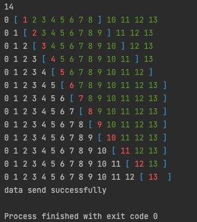
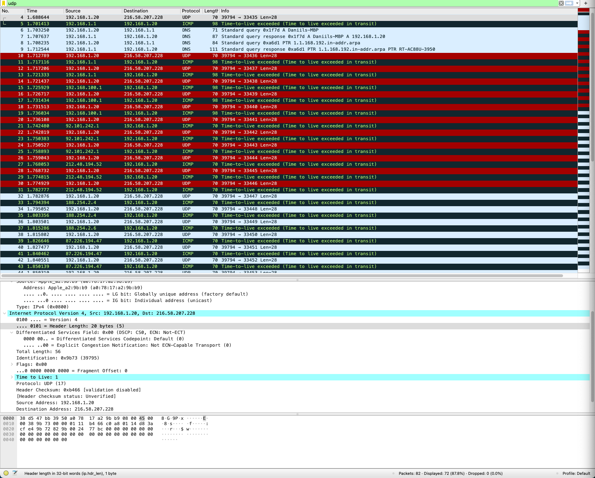
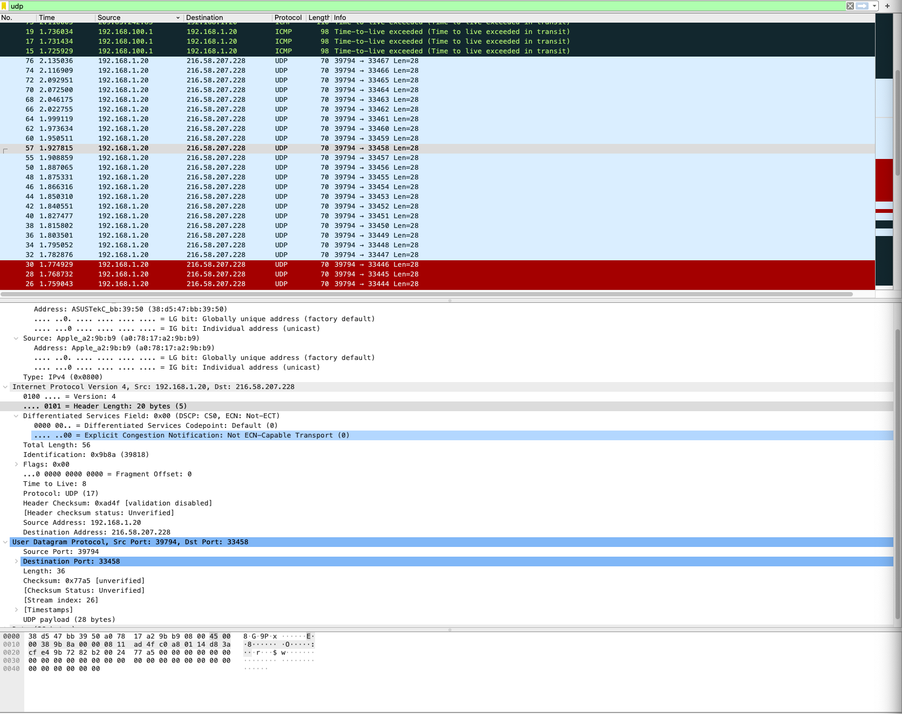
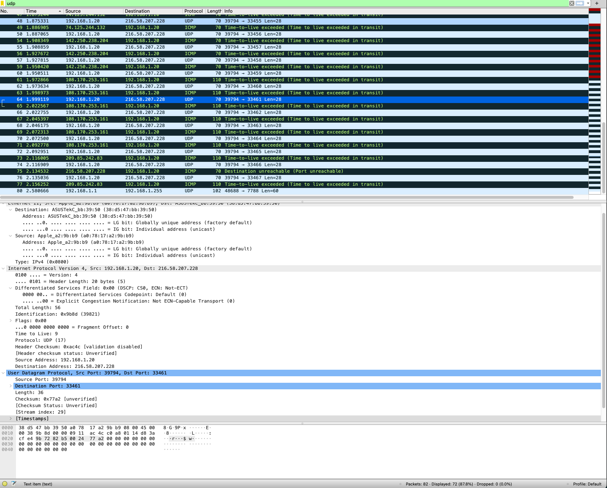
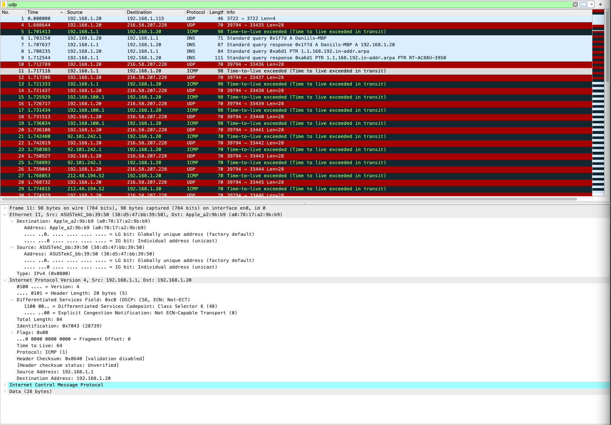
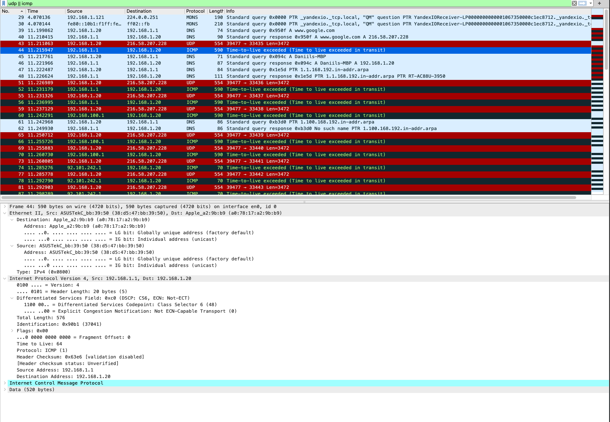
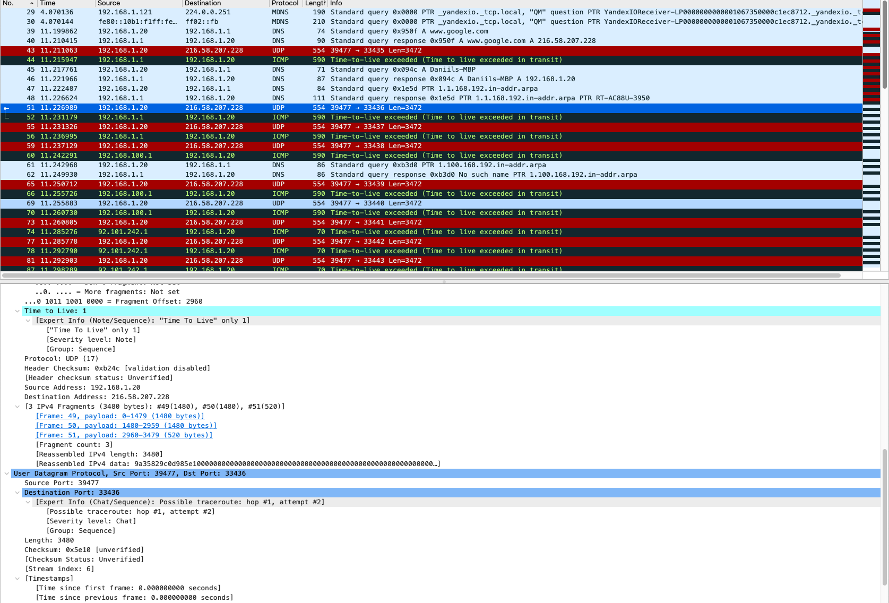
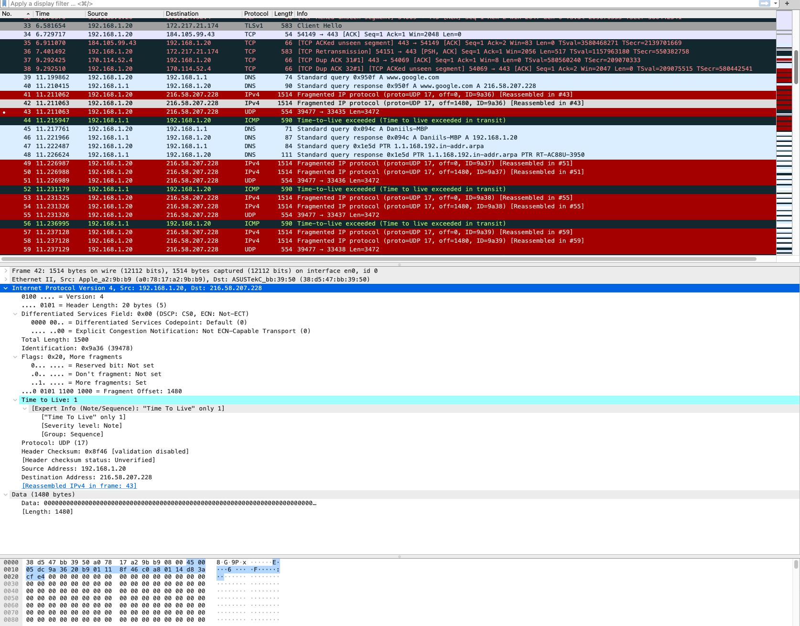

# HW 10, Павленко Даниил

### Программирование. Go back-N протокол

Код с выполненным заданием находится в директории [code_task](code_task).

##### Сервер 

Для сборки и запуска сервера достаточно выполнить следующую команду из корня директории:
```bash 
./gradlew server:run --args="--host <host> --port <port>"
```

Пример запуска:
```bash 
./gradlew server:run --args="--host localhost --port 9005"
```

В таком случае сервер будет ждать подключения клиента, после чего примет файл и сохранит его
в [received.txt](code_task/server/src/main/resources/received.txt).

Также есть дополнительные флаги, их значения можно посмотреть, если вызвать `help (-h)` у сервера.

Пример лога работы программы:
```bash 
Current total size of received data: 4096; Next seq num: 1
Current total size of received data: 8192; Next seq num: 2
Current total size of received data: 12288; Next seq num: 3
Current total size of received data: 16384; Next seq num: 4
Current total size of received data: 20480; Next seq num: 5
Current total size of received data: 24576; Next seq num: 6
Current total size of received data: 28672; Next seq num: 7
Current total size of received data: 32768; Next seq num: 8
Current total size of received data: 36864; Next seq num: 9
Current total size of received data: 40960; Next seq num: 10
Current total size of received data: 45056; Next seq num: 11
Current total size of received data: 49152; Next seq num: 12
Current total size of received data: 53248; Next seq num: 13
Current total size of received data: 53434; Next seq num: 14
content was successfully received
```

##### Клиент

Для сборки и запуска  достаточно выполнить следующую команду из корня директории:
```bash 
./gradlew client:run --args="--host <server host> --port <server port> --file <file to transfer> --window_size <window size>"
```

Пример запуска:
```bash 
./gradlew client:run --args="--host localhost --port 9005 --file src/main/resources/holmes.txt --window_size 8"
```

Пример лога работы программы:



### Wireshark
* `Выберите первое ICMP-сообщение эхо-запроса, отправленное вашим компьютером, и
  раскройте часть информации о пакете Internet Protocol в окне подробной информации.
  Каков IP-адрес вашего компьютера?`\
IP-адрес компьютера: `192.168.1.20`



* `Найдите заголовок IP-пакета. Какое значение указано здесь в поле протокола верхнего
  уровня?`\
Значение в поле протокола равно 17 (`UDP`)

* `Сколько байт в IP-заголовке? Сколько байт приходится на полезную нагрузку IPдейтаграммы?`
Размер заголовка равен 20 байтам (исходя из значения поля `Header length`).  Полезная нагрузка составляет 36 байт, 
сами данные занимают только 28 байт из этих 36.


* `Отсортируйте отслеженные пакеты по их исходному IP-адресу; для этого щелкните по
  заголовку столбца Source. Выберите первое сообщение эхо-запроса, отосланное
  вашим компьютером по протоколу ICMP, и раскройте раздел Internet Protocol.`
  * `Какие поля IP-дейтаграммы всегда изменяются от одной дейтаграммы к
    следующей в рамках одной последовательности ICMP-сообщений, отсылаемых
    компьютером (последовательность – это все сообщения, которые
    отправляются до конечного хоста)?`\
    На сетевом уровне меняются поля: `Identification` и `check sum`. На прикладном (в нашем случае UDP) меняется
    поле `destination port`
    
  * `Какие поля не меняются? Какие поля должны оставаться неизменными? Какие
    поля должны изменяться? (в рамках одного запуска утилиты)`
    На сетевом уровне не меняются поля: `Header length`, `Flags`, `Protocol`, `Total length` и `Destination address`.
    На прикладном не меняется поле `Source port`. Должно изменяться (и изменяется) поле `Time to live`, которое постепенно увеличивается. 
    
  * `Как изменяется значение поля Identification IP-дейтаграммы с каждым
    последующим эхо-запросом? Есть ли какая-либо закономерность?`\
    Закономерность есть `Identification` раз растет на 1.

* `Какое значение содержится в поле Identification (Идентификация), а какое – в поле TTL (выберите какой-либо один пакет ICMP)?`\
В `Identification` лежит значение `0x9b8d`, а в `Time to live`: 9. 
 

* `Остаются ли эти значения (Identification и TTL) неизменными во всех сообщениях
  протокола ICMP, где содержится информация об истечении предписанного времени
  жизни; рассмотрите только те из таких сообщений, которые поступили на компьютер с
  ближайшего (первого транзитного) маршрутизатора.`\
`Identification` у этих сообщений разные, при этом они не соответствуют `Identification`, которые были отосланы компьютерным на предыдущей итерации. 
`Time to live` одинаковый, и он равен 64.

* `Найдите серии откликов ICMP, в которых содержатся сообщения об истечении
  предписанного времени жизни (time-to-live exceeded). Выберите один из пакетов.
  Какое значение содержится в поле Identification (Идентификация), а какое – в поле
  TTL?`\
`Identification` у всех этих сообщений разные, при этом могут повторяться (но возможно это только в случае, когда `Identification` равен 0). 
`Time to live` тоже у каждого свой, и тоже нет какой-то закономерности (хотя казалось, что он должен уменьшаться на 1 к каждому следующему маршрутизатору).

* `Фрагментация. Остановите захват пакетов в Wireshark. Измените размер пакета
  Packet Size = 3500 байт. Снова запустите захват пакетов в Wireshark и перезапустите
  трассировку. (Для Unix заново запустите traceroute с длиной пакета 3500 байт).
  Найдите первое сообщение протокола ICMP с эхо-запросом, поступившее на ваш
  компьютер (с уже измененным размером пакета).`
  * `Было ли это сообщение фрагментировано между двумя или более IPдейтаграммами? Если да, то сколько фрагментов было создано?`\
    Пакеты, которые получает компьютер не фрагментированы и имеют размер 576 байт. Но сообщения, которые отсылает компьютер в начале фрагментированы и разбиты на 3 фрагмента.
    
    
  * `Какие поля IP-заголовка изменяются в разных фрагментах?`\
    Меняются поля `Total length`, `Fragment offset` (в завершающем пакете значение это поля равно 0), а также поле `Flags` (в нем меняется поле `More fragmets`).
    *Пояснение к скриншоту: на скриншоте представлены все пакеты, так как почему-то WireShark определяет протокол фрагментационных пакетов как IPv4, а не UDP*
    
  
