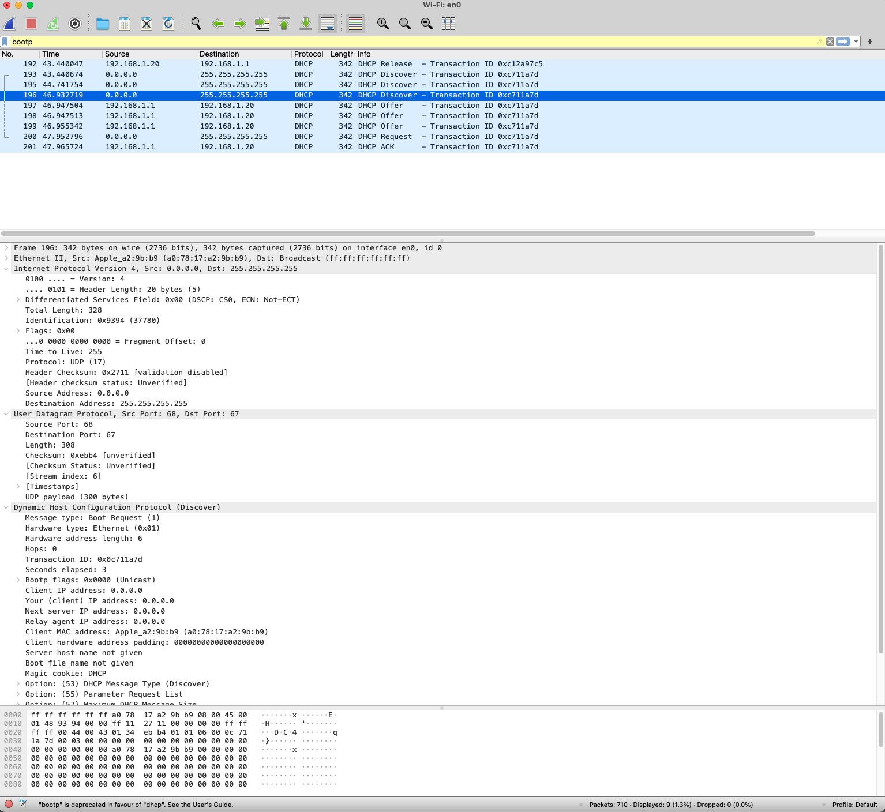
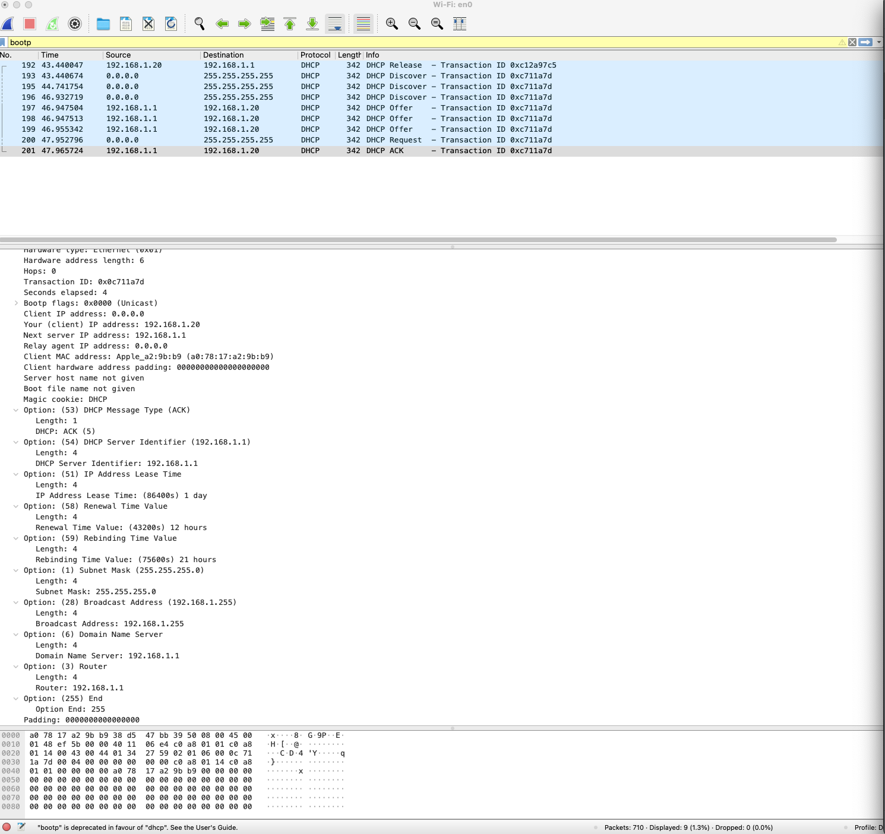

# HW 13, Павленко Даниил

## Wireshark : DHCP

* `Поверх какого протокола посылаются сообщения DHCP – UDP или TCP?`\
Поверх UDP 

* `Каков адрес канального уровня (т.е., Ethernet-адрес) у вашего хоста?`\
Изначально адрес равен `0.0.0.0`, но после прохождения всей процедуры получения локального IP-адреса, адрес хоста 
равен `192.168.1.20`

* `Каковы значения Transaction-ID в наборе (Request/ACK) DHCP-сообщений? Опишите
  назначение поля Transaction-ID.`\
Transaction-ID равен `0x0c711a7d`\

* `Хост использует DHCP-протокол, в частности, для получения IP-адреса. Но IP-адрес хоста
  остается неподтвержденным до завершения обмена DHCP сообщениями. Если IP-адрес не
  установлен до завершения обмена сообщениями, то какие значения используются в IPдейтаграммах при обмене этими сообщениями? Укажите исходный и конечный IP-адреса,
  передаваемые в инкапсулирующей IP-дейтаграмме DHCP сообщений`\
IP-адрес роутера равен `192.168.1.1`, при этом хост отсылает сообщения с IP-адресом `0.0.0.0` на адрес `255.255.255.255`, 
что видимо является broadcast'ом.  

* `Каков IP-адрес вашего DHCP-сервера?`\
IP-адрес DHCP-сервера (роутера) - `192.168.1.1`

* `Объясните назначение срока аренды IP-адреса. Какова длительность срока аренды в вашем эксперименте?`\
Длительность срока аренды IP-адреса (`IP Address Lease Time`) равен 1 дню. Обновление `lease` будет через 12 часов 
(`Renewal Time Value`). Если же подтверждения не происходит в течение 9 часов (так как `Rebinding Time Value` равно 21 часу),
то начинается процесс ребиндинга, в котором хост может либо получить продление `lease`, либо указание начать заново 
процесс получения IP-адресса. 

`IP Address Lease Time` используется, так как в локальной сети есть лишь конечное количество
IP-адресов, поэтому IP-адрес не закрепляется за девайсом на бесконечное время. 

## Программирование

Код с выполненным заданием находится в директории [code_task](code_task/)

Проверка работоспособности алгоритма выполнена в качестве юнит-тестов, которые можно запустить при помощи команды 
`gradle test` из корня директории.

## Задачи

### Задача 1

* Заметим, что максимум $Np(1-p)^{N - 1}$ достигается не в точках $p = 0$ и $p = 1$. Таким образом, мы можем прологарифмировать 
функцию и найти максимум уже функции $f(p) = \log N + \log p + (N - 1) \cdot \log (1 - p)$. 
Так как максимум не лежит в границах отрезка, то в точке максимума выполняется условие $f'(p) = 0$. То есть: 

  $\frac{1}{p} - \frac{N - 1}{1 - p} = 0$

  $\frac{(1 - p) - (N - 1)p}{p(1 - p)} = 0$

  $p = \frac{1}{N}$

  Ответ: $p = \frac{1}{N}$

* Таким образом максимум функции при фиксированном $N$ равен 
  $N \cdot \frac{1}{N} \cdot (1 - \frac{1}{N})^{N - 1} = (1 - \frac{1}{N})^{N - 1}$, 
  что стремится к $e^{-1}$ по следствию замечательного предела.

  Ответ: $e^{-1}$

### Задача 2

* Заметим, что чтобы узлу А с первого раза передать информацию в кванте нужно чтобы совпало два события: 
    * узел А начал пересылку своего покета, что случается с вероятностью $p$
    * все остальные узлы не стали посылать, что случается с вероятностью $(1 - p)^3$
  
  Таким образом, общая вероятность события равна $p(1 - p)^3$ (так как описанные выше события независимы).

  Ответ: $p(1 - p)^3$

* Заметим, что мы можем применить те же рассуждения, что и в предыдущем пункте для каждого узла по отдельности. Также заметим,
  что события эти не пересекаются, поэтому мы можем сложить вместе вероятности для каждого узла и это будет ответ.

  Ответ: $3p(1 - p)^3$

* Заметим, что в каждом раунде может случиться 2 события:
    * только один узел послал сообщение и коллизии не случилось, что случается с вероятностью $4p(1 - p)^3$
    * успешной отправки не произошло, вероятность чего равна $1 - 4p(1 - p)^3$
  
  Таким образом, вероятность, что первая успешная передача произойдет в кванте 3, равна 
  $(1 - 4p(1 - p)^3)^3(4p(1 - p)^3)$

  Ответ: $(1 - 4p(1 - p)^3)^3(4p(1 - p)^3)$

* Эффективность системы, равна $4p(1 - p)^3$, и ее максимум составляет $\frac{3}{4}^3$ при $p = \frac{1}{4}$.

  Ответ: $4p(1 - p)^3$
