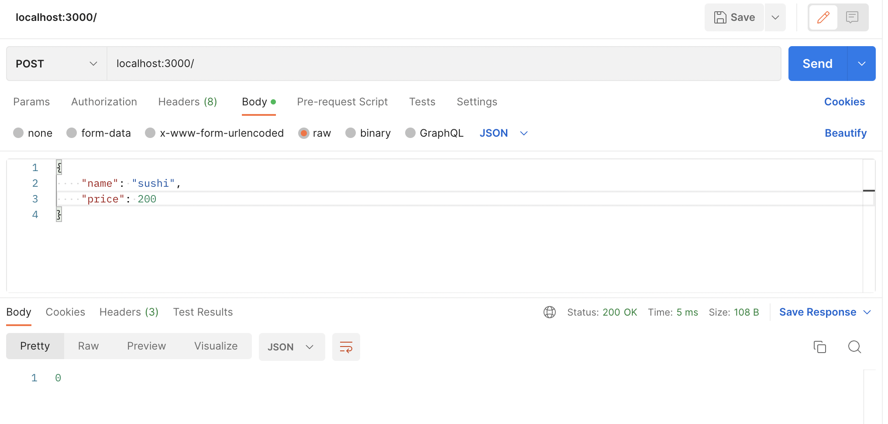
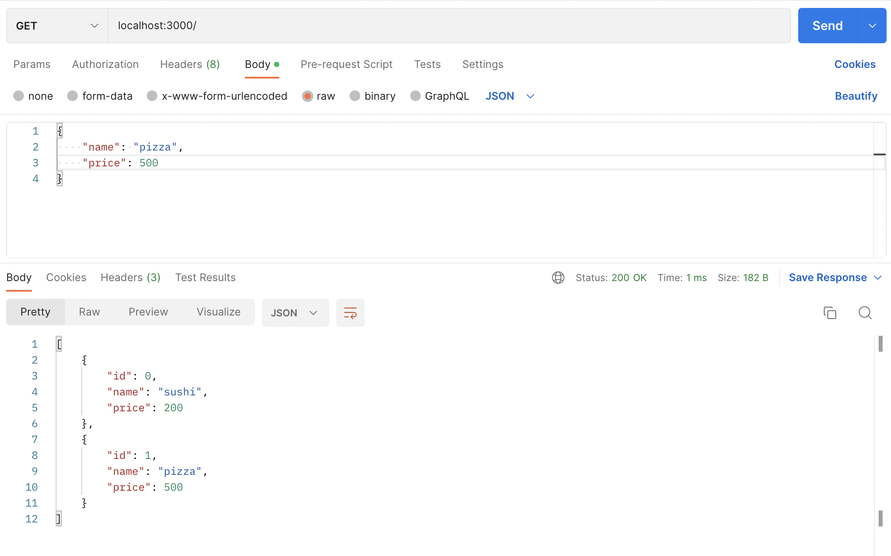
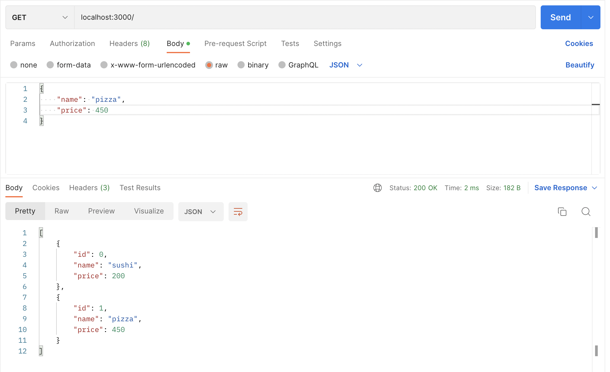
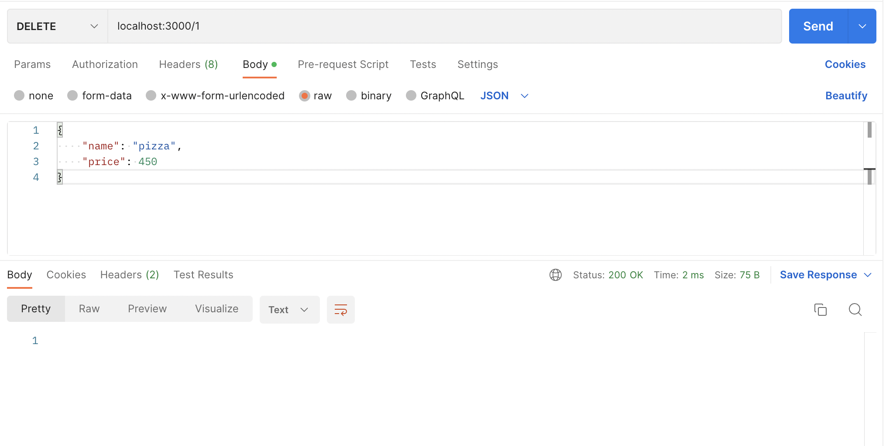
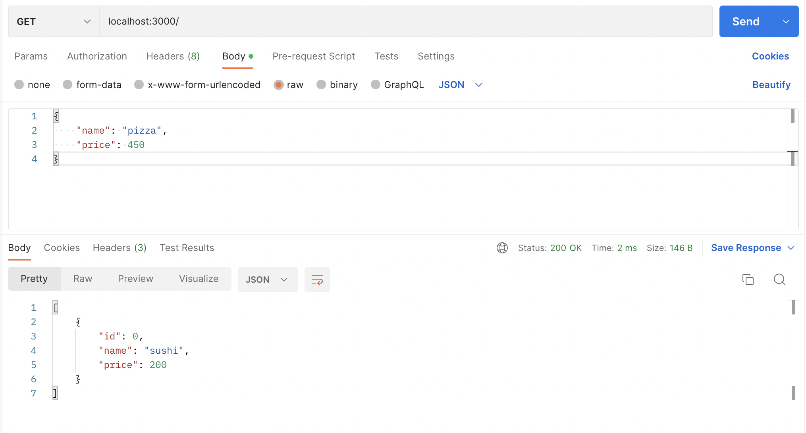
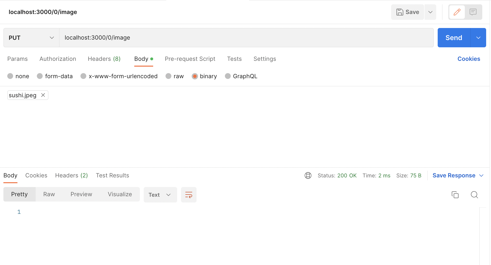
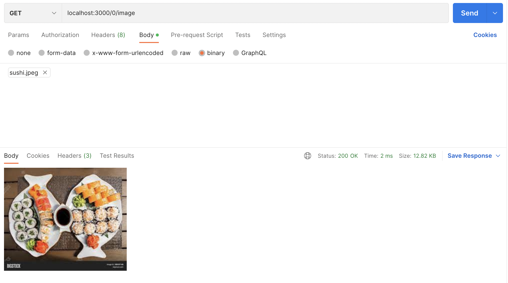

## HW 2, Павленко Даниил

## Задачи

------

Так как Markdown не поддерживает LaTeX, решение задач находится в файле [tasks.pdf](tasks.pdf).

## Rest Service

------

[Код HTTP-сервера](server). 

В качестве примера функциональности сервера рассмотрим последовательность запросов из postman'а. 

* Сначала добавим при помощи `POST` два продукта: `(Sushi, 200)` и `(Pizza, 500)`, где первое поле - название продукта, а второе - цена. 

* Теперь запросим список всех продуктов и какого-то конкретного продукта по *id* при помощи `GET`

* Обновим параметры у пиццы (с *id* = 1), а именно изменим цену с 500 на 450 при помощи PUT запроса. 

* Удалим пиццу по *id* при помощи DELETE запроса. 

* Добавим изображение для суши при помощи PUT запроса и проверим, что оно правильно сохранилось при помощи GET запроса. 

