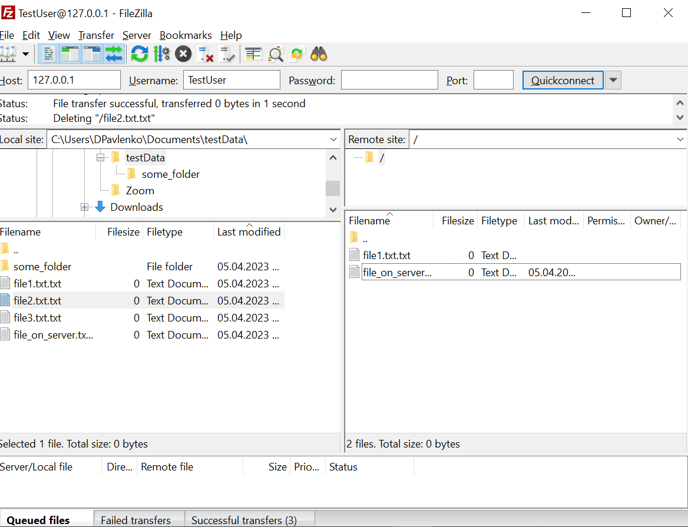

# HW 6, Павленко Даниил

## Wireshark: UDP

* `Выберите один UDP-пакет. По этому пакету определите, сколько полей содержит UDPзаголовок.`\
Заголовок UDP-пакета содержит 4 поля: порт получателя, порт отправителя, размер сообщения и чек-сумму.

* `Определите длину (в байтах) для каждого поля UDP-заголовка, обращаясь к отображаемой
  информации о содержимом полей в данном пакете.`\
Ответ: длина всех полей составляет 2 байта, на скрине приложен пример как был получен данный результат для 
поля `Destination port`.

* `Значение в поле Length (Длина) – это длина чего?`\
Значение в полу Length - 41 байт, показывает размер UDP-пакета, включая UDP-заголовки.

* `Какое максимальное количество байт может быть включено в полезную нагрузку UDP-пакета?`\
Так как размер поля `Length` составляет 16 бит, максимальный возможный размер UDP-пакета: 65535 байт

* `Чему равно максимально возможное значение номера порта отправителя?`\
Так как размер поля `Source port` так же составляет 16 бит, то максимальный возможный порт отправителя: 65535.  

* `Какой номер протокола для протокола UDP? Дайте ответ и для шестнадцатеричной и
  десятеричной системы. Чтобы ответить на этот вопрос, вам необходимо заглянуть в поле
  Протокол в IP-дейтаграмме, содержащей UDP-сегмент.`\
Номер протокола: 17

* `Проверьте UDP-пакет и ответный UDP-пакет, отправляемый вашим хостом. Определите
  отношение между номерами портов в двух пакетах.`\
В ответном пакете `Source port` и `Destination port` поменяны местами по сравнению с входящим пакетом.


## Программирование. FTP 

### 1. FileZilla сервер и клиент





### 2. FTP клиент

Код для ftp-клиента находится в директории [ftp-client](ftp-client/).

Для того что бы запустить `ftp-client` достаточно выполнить следующую команду из корня директории клиента: 
```bash 
./gradlew run --args="--server <host> --port <port> --login <login> --password <password>"
```

Далее клиент работает в интерактивном режиме и поддерживает следующие команды: 
* `l <path to directory to list>` - получить список всех под-директорий и файлов сервера соответствующей директории и вывести их
* `u <local source file> <remote destination file>` - загрузить файл на сервер 
* `d <remote source file> <local destination file>` - загрузить файл с сервера
