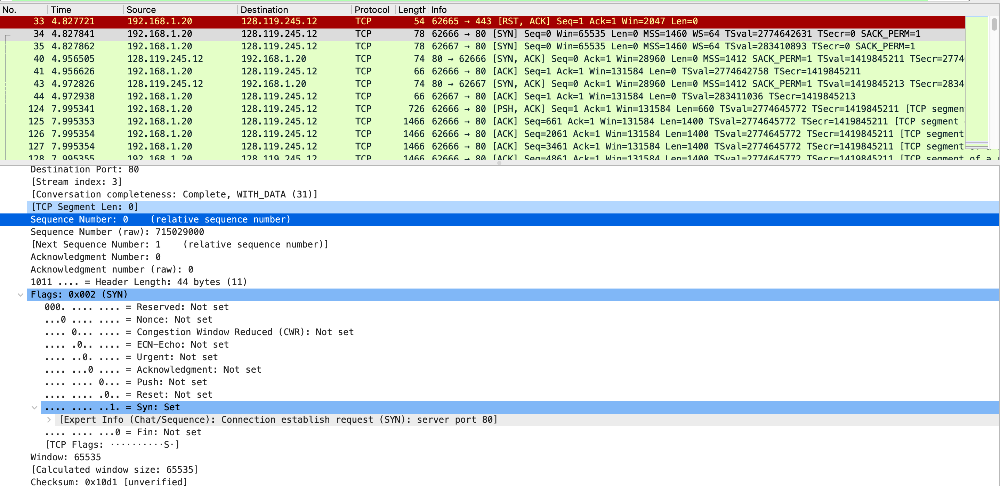

# Lab 07, Павленко Даниил 

## 1. Wireshark: TCP 

* `Какой IP-адрес и номер порта TCP использует ваш компьютер (отправитель), передающий
  файл серверу gaia.cs.umass.edu? Для ответа на вопрос, возможно, проще выбрать httpсообщение и рассмотреть информацию TCP-пакета, используемого для передачи этого
  http-сообщения, в окне деталей заголовка пакета`\
Клиент имеет адрес `192.168.1.20` и использует порт `62666`.

* `Каков IP-адрес у сервера gaia.cs.umass.edu? Каковы номера портов для отправки и приема
  TCP-сегментов этого соединения?`\
`gaia.cs.umass.edu` имеет `128.119.245.12` IP-адрес, а также порты `443` (для резета соединения) и `80` для передачи и получения данных.


* `Какой порядковый номер у SYN TCP-сегмента, который используется для установления
  TCP-соединения между компьютером клиента и сервером gaia.cs.umass.edu? Как
  определяется, что это именно SYN-сегмент?`\
`SYN` имеет номер 0. `SYN` определяется тем, что в TCP-header'е выставлен флаг `Syn`. 


* `Какой порядковый номер у SYNACK-сегмента, отправленного сервером gaia.cs.umass.edu
  на компьютер клиента в ответ на SYN-сегмент? Какое значение хранится в поле
  подтверждения в SYNACK-сегменте? Как сервер gaia.cs.umass.edu определил это значение?
  Как определяется, что это именно SYNACK-сегмент?`\
`SYNACK` имеет порядковый номер 1. `SYN` определяется тем, что в TCP-header'е 2 флага: 
`Syn` и `Acknowledgment`. 



* `Какой порядковый номер у TCP-сегмента, содержащего команду POST протокола HTTP?
  (для нахождения команды POST вам потребуется проникнуть внутрь поля содержимого
  пакета в нижней части окна Wireshark, чтобы найти сегмент, в поле DATA которого
  хранится значение POST)`\ 

TCP-сегмент, который содержит POST запрос так же имеет порядковый номер 1. 


* `Рассмотрите TCP-сегмент, содержащий команду POST протокола HTTP, как первый TCPсегмент соединения. Какие порядковые номера у первых шести сегментов TCPсоединения (включая сегмент, содержащий команду POST протокола HTTP)? Когда был
  отправлен каждый сегмент? Когда был получен ACK-пакет для каждого сегмента?
  Покажите разницу между тем, когда каждый TCP-сегмент был отправлен и когда было
  получено каждое подтверждение, чему равно значение RTT для каждого из 6 сегментов?`\

Первые 6 TCP-сегментов имеют номера: 0 -> 0 -> 1 -> 1 -> 661 -> 2061. При хендшейке ACK приходил сразу после запроса, то есть вызов ожидал ACK в ответ. 
Timestamps каждого сегмента: 0.00, 0.128, 0.129, 3.167, 3.168, 3.29. Каждый TCP-сегмент хранит внутри себя iRTT - RTT во время хендшейка и это значение равно 0.1228, 
также каждый ACK содержит RTT для этого TCP-сегмента, это значение варируется примерно от 0.122 до 0.20. 


* `Чему равна пропускная способность (количество байтов, передаваемых в единицу времени) для этого TCP-соединения? Объясните, как вы получили это значение.`\ 
Размер окна составляет ~ 131КБ, RRT ~ 0.128 c. Таким образом максимальная пропускная способность: $\frac{131000}{0.128} \approx 1023437$, что примерно 1Мб.

### Программирование. Эхо запросы через UDP

Задание выполнено в директории [udp](udp/).

Файл [server.go](udp/server.go) аккумулирует все требования для сервера из заданий A-Г. Пример запуска сервера: 
```bash 
go run server.go <port> <service timeout>
```


Файл [server.go](udp/server.go) аккумулирует все требования для клиента из заданий A-Г. Пример запуска сервера: 
```bash 
go run client.go <server endpoint> 
```

Пример вывода клиента: 
```bash
$ go run client.go localhost:5000
response:  1 2023-04-09T12:48:01.596Z
26 bytes from 127.0.0.1:5000: icmp_seq=1, time=552.25µs
response:  2 2023-04-09T12:48:01.597Z
26 bytes from 127.0.0.1:5000: icmp_seq=2, time=77.792µs
response:  3 2023-04-09T12:48:01.597Z
26 bytes from 127.0.0.1:5000: icmp_seq=3, time=76.75µs
response:  4 2023-04-09T12:48:01.597Z
26 bytes from 127.0.0.1:5000: icmp_seq=4, time=77.125µs
Request timed out
response:  5 2023-04-09T12:48:02.602Z
26 bytes from 127.0.0.1:5000: icmp_seq=5, time=235.25µs
Request timed out
response:  6 2023-04-09T12:48:03.606Z
26 bytes from 127.0.0.1:5000: icmp_seq=6, time=221.125µs
response:  7 2023-04-09T12:48:03.606Z
26 bytes from 127.0.0.1:5000: icmp_seq=7, time=115.708µs
response:  8 2023-04-09T12:48:03.606Z
26 bytes from 127.0.0.1:5000: icmp_seq=8, time=100.417µs
Request timed out
response:  9 2023-04-09T12:48:04.607Z
26 bytes from 127.0.0.1:5000: icmp_seq=9, time=192.292µs
Request timed out
response:  10 2023-04-09T12:48:05.611Z
27 bytes from 127.0.0.1:5000: icmp_seq=10, time=286.959µs
14 packets transmitted, 10 packets received, 28.571430 % packet loss
round-trip min/avg/max = 76.75µs / 193.566µs / 552.25µs
```

Пример вывода сервера: 
```bash 
$ go run server.go 5000 2
message 1 2023-04-09T12:48:01.596Z; from: 127.0.0.1:53185
time diff: 1ms
message 2 2023-04-09T12:48:01.597Z; from: 127.0.0.1:53185
time diff: 0s
time from last message: 156.958µs
message 3 2023-04-09T12:48:01.597Z; from: 127.0.0.1:53185
time diff: 0s
time from last message: 97.834µs
message 4 2023-04-09T12:48:01.597Z; from: 127.0.0.1:53185
time diff: 0s
time from last message: 90.459µs
message 5 2023-04-09T12:48:01.597Z; from: 127.0.0.1:53185
simulate package loss to 127.0.0.1:53185
message 5 2023-04-09T12:48:02.602Z; from: 127.0.0.1:53185
time diff: 0s
time from last message: 1.004709875s
message 6 2023-04-09T12:48:02.602Z; from: 127.0.0.1:53185
simulate package loss to 127.0.0.1:53185
message 6 2023-04-09T12:48:03.606Z; from: 127.0.0.1:53185
time diff: 0s
time from last message: 1.004132375s
message 7 2023-04-09T12:48:03.606Z; from: 127.0.0.1:53185
time diff: 0s
time from last message: 165.125µs
message 8 2023-04-09T12:48:03.606Z; from: 127.0.0.1:53185
time diff: 0s
time from last message: 147.167µs
message 9 2023-04-09T12:48:03.606Z; from: 127.0.0.1:53185
simulate package loss to 127.0.0.1:53185
message 9 2023-04-09T12:48:04.607Z; from: 127.0.0.1:53185
time diff: 0s
time from last message: 1.00091125s
message 10 2023-04-09T12:48:04.607Z; from: 127.0.0.1:53185
simulate package loss to 127.0.0.1:53185
message 10 2023-04-09T12:48:05.611Z; from: 127.0.0.1:53185
time diff: 0s
time from last message: 1.003509041s
service 127.0.0.1:53185 was stopped
```

### Задача 2

Пусть $w$ - размер окна в битах, тогда $\frac{w}{RTT} = R \Rightarrow w = R \cdot RTT = 30 * 10^{6} \text{бит}$. Так как 
размер каждого пакета равен $B = 12 * 10^{3}$ бит, то размер окна $n = \frac{w}{B} = 2500$

Ответ: 2500.