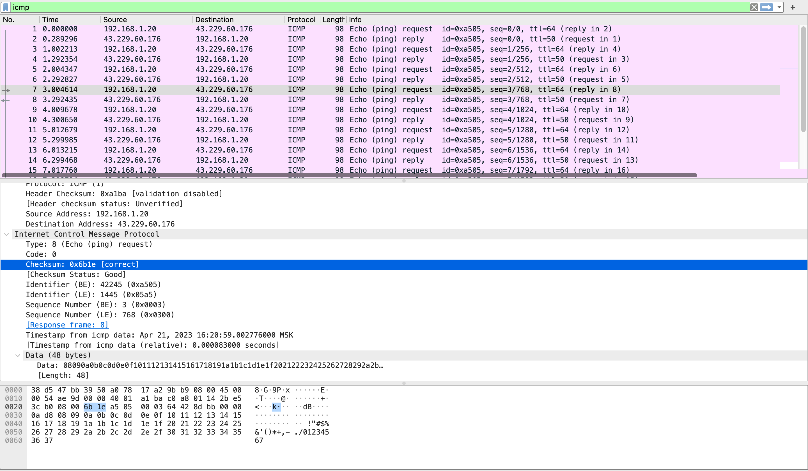
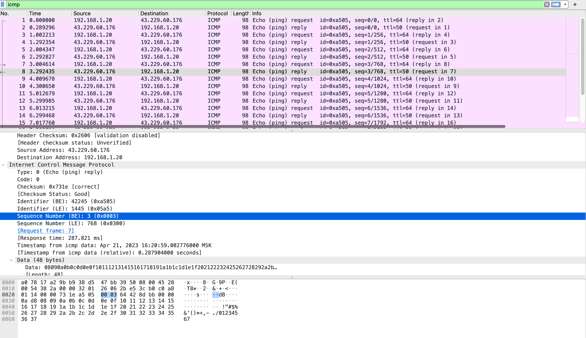
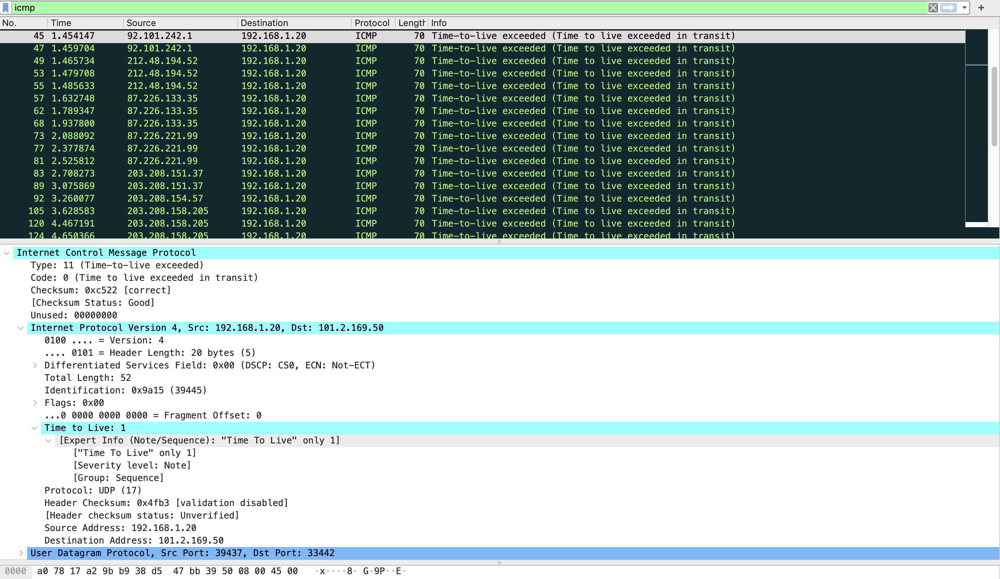
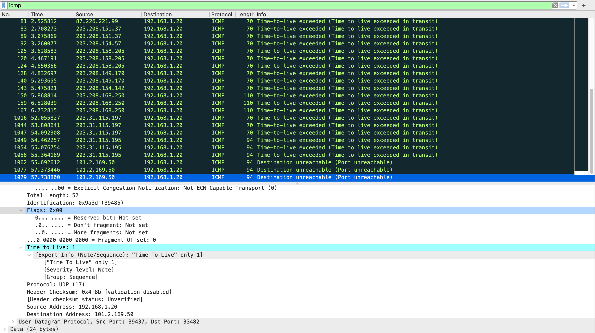

# HW 9, Павленко Даниил

## Программирование. 

Код с выполненным заданием находится в директории [code_task](code_task/).

### IP-адрес и маска сети

Для запуска программы достаточно выполнить следующую команду из корня директории: 
```bash 
python3 local_info.py
```

Пример работы программы:
```bash
$ python3 local_info.py
IP address: 192.168.1.20
Network mask: 255.255.255.0
```

### Доступные порты

Для запуска программы достаточно выполнить следующую команду из корня директории: 
```bash 
python3 available_ports.py --host <host> --port_begin <port> --port_end <port>
```

Пример работы программы:
```bash
$ python3 available_ports.py --host localhost --port_begin 5 --port_end 1050
available ports: 1024 1025 1026 1027 1028 1029 1030 1031 1032 1033 1034 1035 1036 1037 1038 1039 1040 1041 1042 1043 1044 1045 1046 1047 1048 1049
```

## Wireshark: ICMP 

### 1. Ping

* `Каков IP-адрес вашего хоста? Каков IP-адрес хоста назначения?`\
Я взял сразу IP-адрес, так почти у всех известных мне хостов оказались сервера в Европе и если пинговать тот же самый 
`www.google.com.au`, то он идет по IP-адресу 8.8.8.8 и выбирает европейский сервер. Поэтому я взял Австралийский DNS 
сервер, который находится в Сиднее, `43.229.60.176`.  

* `Почему ICMP-пакет не обладает номерами исходного и конечного портов?`\ 
Ответ: ICMP - протокол сетевого уровня, а не транспортного, поэтому он предназначен для общения между хостами, а не приложений. 
Значит и порты ему ни к чему.

* `Рассмотрите один из ping-запросов, отправленных вашим хостом. Каковы ICMP-тип и кодовый
номер этого пакета? Какие еще поля есть в этом ICMP-пакете? Сколько байт приходится на поля
контрольной суммы, порядкового номера и идентификатора?`\
Тип: `Echo (ping) request` (8); `Code` - 0. На чек-сумму приходится 2 байта. В этом пакете есть еще поля с исходным адресом (`Source address`), адресом получателя (`Destination address`),
чек-сумой (`Checksum`), порядковым номером (`Sequence number`), идентификатор (`Identifier`), 
временную метку (`Timestamp from icmp data`) и другими. 



* `Рассмотрите соответствующий ping-пакет, полученный в ответ на предыдущий. 
Каковы ICMPтип и кодовый номер этого пакета? Какие еще поля есть в этом ICMP-пакете? Сколько байт
  приходится на поля контрольной суммы, порядкового номера и идентификатора?`\
Тип и кодовый номер такие же: `Echo (ping) request` (но код этого типа: 0), а `Code` так же 0. Поля аналогичны предыдущему пункту.
На чек-сумму, идентификатор и порядковый номер приходится по 2 байта. 



### 2. Traceroute 

* `Рассмотрите ICMP-пакет с эхо-запросом на вашем скриншоте. Отличается ли он от ICMP-пакетов с ping-запросами из Задания 1 (Ping)? Если да – то как?`\
Да, пакеты отличаются. Тип пакета теперь `Time-to-live exceeded` (11). Также пропали поля времени (`Timestamp`) и порядкового номера (`Sequence number`),
но появились поля `Time to live`, `Flags` и `Differentiated Service Field`.



* `Рассмотрите на вашем скриншоте ICMP-пакет с сообщением об ошибке. В нем больше полей, чем в ICMP-пакете с эхо-запросом. Какая информация содержится в этих дополнительных полях?`\
Появилось поле `Time to live`, в котором хранится максимальное количество хопов, которое пакет может пройти. 
Также появились поле `flags`, в которым отражены различные выставленные флаги и `Differentiated Service Field` (видимо дополнительное поле, чтобы контролировать нагрузку трафика). 

* `Рассмотрите три последних ICMP-пакета, полученных исходным хостом. Чем эти пакеты отличаются от ICMP-пакетов, сообщающих об ошибках? Чем объясняются такие отличия?`\
В этих трех пакетах ошибка не `Time-to-live exceeded`, а `Destination unreachable`. Когда ICMP пакет доходит то сервера, 
до которого запущен traceroute, этот сервер уже не может вернуть `Time-to-live exceeded`, при этом traceroute использует случайный
порт и ожидает, что на этом порте нет listener'а, поэтому приходящий пакет никто не может обработать и он возвращается с ошибкой 
`Destination unreachable`.



* `Есть ли такой канал, задержка в котором существенно превышает среднее значение? Можете ли вы, опираясь на имена маршрутизаторов, определить местоположение двух маршрутизаторов, расположенных на обоих концах этого канала?`\
Возьмем для примера `traceroute` до хостинга DNS-сервера в Сиднее: *43.229.60.176*. Есть следующий переход: 
```
10  203.208.168.250 (203.208.168.250)  203.893 ms  203.401 ms  204.648 ms
11  * * *
12  * * *
13  * * *
14  * * *
15  ns1rtrv-apx-ipt.binarylane.cloud (27.122.122.10)  284.842 ms  337.130 ms  307.137 ms
```

То есть от `203.208.168.250` до `ns1rtrv-apx-ipt.binarylane.cloud` пакет идет дольше 100 мс, значит, предположительно, они находятся на разных континентах. 
Если прогуглить, то это действительно так: `203.208.168.250` - вроде как один из IP-адресов в Сингапуре, а
`ae10.paloalto2.pao.seabone.net (195.22.206.148)` - хост облака, которое расположено в Австралии.

## Задачи 

### Задача 2.1

Допустим, текущее окно имеет размер $\frac{W}{2}$. Пусть, чтобы размер окна превысил $W$ нужно получить $T$ с этого момента, тогда 
утверждается, что $L = \frac{1}{T + 1}$, так как у $T$ пакетов размер окна будет меньше $W$, а значит на них придет $ACK$, а у 
$T + 1$ пакета размер окна уже будет $\ge W$, а на него ответ не будет получен. 

Значит нужно найти $T$. $T = \lceil \log_{a}(\frac{W}{\frac{W}{2}}) \rceil = \lceil \log_{a}(2) \rceil$, то есть $T$ от $W$ не зависит. Таким образом, 
$L = \frac{1}{\lceil \log_{a}(2) \rceil}$. 

Ответ: $L = \frac{1}{\lceil \log_{a}(2) \rceil}$

### Задача 2.3 

Заметим, что чтобы от размера окна $\frac{W}{2}$ прийти к размеру окна $W$ нужно сделать константное количество шагов, 
а именно $K = \lceil \log_{a}(2) \rceil$. Значит количество времени для увеличения размера окна перегрузки с $\frac{W}{2}$ до 
$W$ равно $K \cdot RTT$, что не зависит от средней пропускной способности, что и требовалось.